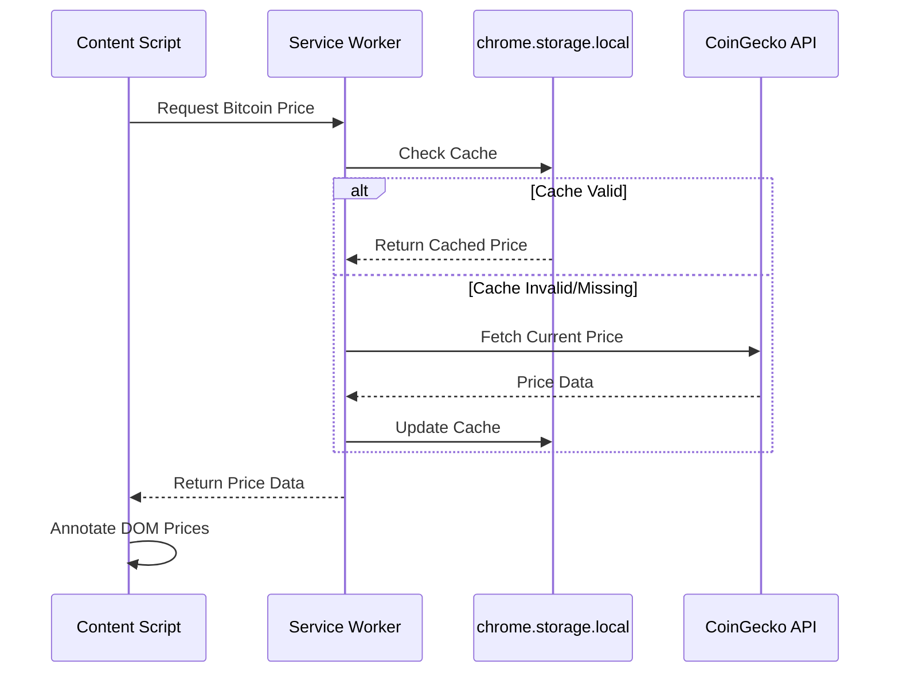

# Bitcoin Price Tag

[](https://github.com/phrazzld/bitcoin-price-tag/actions/workflows/ci.yml)
[](https://codecov.io/gh/phrazzld/bitcoin-price-tag)
[](https://opensource.org/licenses/MIT)
[](https://nodejs.org/)

Chrome extension that automatically annotates fiat prices on web pages with their equivalent values in bitcoin.


## Features

- Automatically detects and annotates USD prices on any webpage with bitcoin equivalents  
- Uses real-time bitcoin price data from CoinGecko API
- Shows prices in appropriate units (sats, k sats, M sats, BTC)
- Handles various price formats ($100, $1.5k, 100 USD, etc.)
- Special handling for Amazon price elements

## Installation

### Prerequisites

- Node.js 18.x or higher
- pnpm (Package manager)

### Development Setup

1. Clone the repository:
   ```bash
   git clone https://github.com/yourusername/bitcoin-price-tag.git
   cd bitcoin-price-tag
   ```

2. Install dependencies:
   ```bash
   pnpm install
   ```

3. Build the extension:
   ```bash
   pnpm build
   ```
   
   The build uses webpack to bundle the TypeScript modules into browser-compatible JavaScript.

### Loading the Extension in Chrome

1. Open Chrome and navigate to `chrome://extensions/`
2. Enable "Developer mode" using the toggle in the top right
3. Click "Load unpacked" button
4. Select the `dist` folder from the project directory
5. The extension icon should appear in your Chrome toolbar

## Usage

Once installed, the extension runs automatically:

1. Navigate to any webpage with USD prices
2. Prices will be automatically annotated with their bitcoin equivalents
3. Example: "$100" becomes "$100 (2.5M sats)"

The extension periodically updates the bitcoin price in the background to ensure conversions are current.

## Development

### Available Scripts

- `pnpm build` - Builds the extension for production
- `pnpm test` - Runs the test suite
- `pnpm lint` - Runs ESLint for code quality
- `pnpm typecheck` - Runs TypeScript type checking

### Project Structure

```
src/
├── service-worker/      # Background service worker
│   ├── index.ts        # Service worker entry point
│   ├── api.ts          # CoinGecko API client
│   └── cache.ts        # Price data caching
├── content-script/      # Page content scripts  
│   ├── index.ts        # Content script entry point
│   ├── dom.ts          # DOM manipulation for price annotation
│   └── messaging.ts    # Communication with service worker
├── common/             # Shared code
│   ├── types.ts        # TypeScript interfaces
│   └── constants.ts    # Shared constants
├── shared/             # Utility modules
│   └── logger.ts       # Structured logging utility
└── manifest.json       # Extension manifest (Manifest V3)
```

## Architecture

This extension uses Chrome's Manifest V3 architecture:

### Service Worker
- Handles background tasks and API communication
- Fetches bitcoin prices from CoinGecko API
- Manages persistent price cache using `chrome.storage.local`
- Responds to price requests from content scripts
- Uses `chrome.alarms` for periodic price updates

### Content Script
- Runs on every webpage
- Scans DOM for price patterns using regex
- Requests current bitcoin price from service worker
- Annotates prices with bitcoin equivalents

### Data Flow



## Manifest V3 Migration

This extension has been migrated from Manifest V2 to V3, implementing:

- Service worker instead of background pages for better performance
- Declarative net request handling
- Enhanced security with narrower permissions
- Persistent storage using `chrome.storage.local`
- Alarm-based periodic updates

Key design decisions:
- Service worker acts as a caching API layer to minimize API calls
- Content scripts remain lightweight, focusing only on DOM manipulation
- TypeScript for type safety and better developer experience
- Structured logging for debugging and monitoring
- Silent error handling to maintain non-intrusive user experience (see [Error Handling](docs/ERROR_HANDLING.md))

> **Note:** The original Manifest V2 files have been archived and are available for reference in the [archive/manifest-v2](archive/manifest-v2) directory.

## Contributing

1. Fork the repository
2. Create your feature branch (`git checkout -b feature/amazing-feature`)
3. Commit your changes using conventional commits (`git commit -m 'feat: add amazing feature'`)
4. Push to the branch (`git push origin feature/amazing-feature`)
5. Open a Pull Request

## License

[MIT](https://opensource.org/licenses/MIT)

## Acknowledgments

- Fork of the original extension published [here](https://chrome.google.com/webstore/detail/bitcoin-price-tag/phjlopbkegpphenpgimnlckfmjfanceh)
- Bitcoin price data provided by [CoinGecko API](https://www.coingecko.com/)